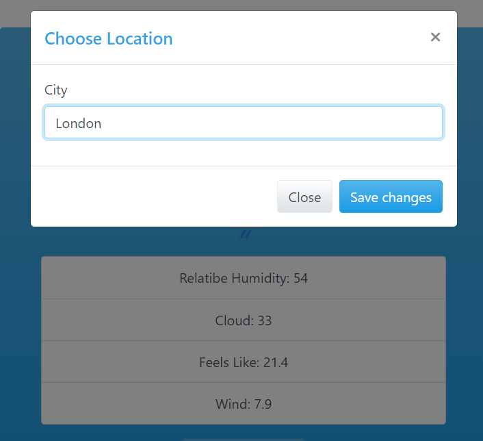

# Weather

With Weather, you can find details about the weather in every city in the world.
I created this project in order to practice usage of APIs and working with local storage.

Demo: https://idogo-weather.netlify.app

## Table Of Contents
- [Weather](#Weatherr)
  * [Screenshots](#screenshots)
    + [Main](###Main)
    + [Change Location](###ChangeLocation)
  * [Tech Stack](#tech-stack)
  
## Screenshots
### Main
Here you can see a variety of details about your chosen city.

### Change Location
By clicking the *Change Location* button, a modal plugin will pop up. There you can chose a city and click the *Save changes* button.

## Tech stack
1. HTML
2. CSS
3. Weather API
4. Bootstrap
